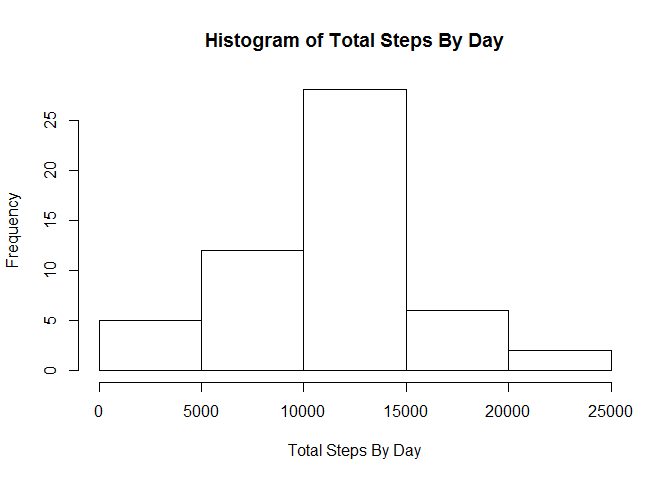
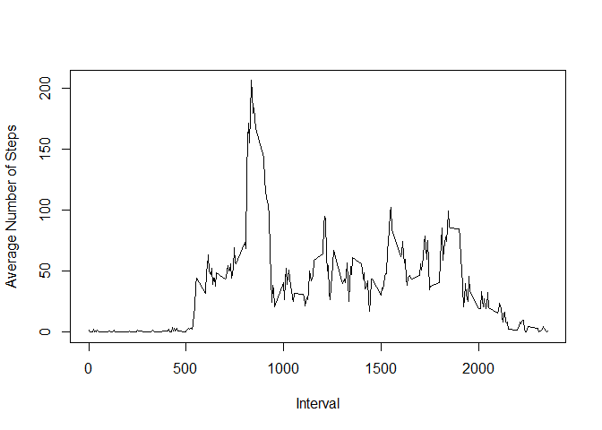
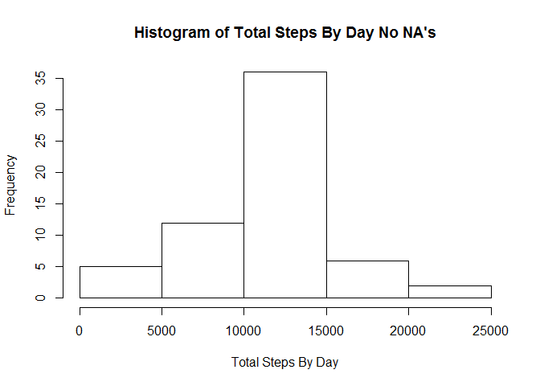
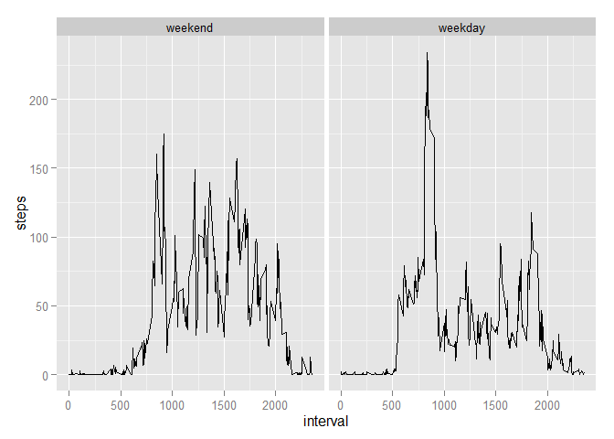

# Reproducible Research: Peer Assessment 1


## Loading and preprocessing the data

```r
setwd("~/DataScience/Reproducible Research/RepData_PeerAssessment1")
steps <- read.csv(unz("activity.zip", "activity.csv"))
steps$date = as.Date(steps$date)
```

## What is mean total number of steps taken per day?

```r
stepsByDay <- aggregate(steps ~ date, data = steps, FUN = sum, na.rm = TRUE)
hist(stepsByDay$steps, xlab ="Total Steps By Day",  
     main = "Histogram of Total Steps By Day")
```

 

```r
meanSteps <- mean(stepsByDay$steps, na.rm = TRUE)
meanSteps <- format(round(meanSteps, 2), nsmall = 2)

medianSteps <- median(stepsByDay$steps, na.rm = TRUE)
medianSteps <- format(round(medianSteps, 2), nsmall = 0)
```
The mean total number of steps taken per day is 10766.19.  
The median total number of steps taken per day is 10765.

## What is the average daily activity pattern?

```r
meanByInterval <- aggregate(steps ~ interval, data = steps, FUN = mean,
                            na.rm = TRUE)
plot(meanByInterval$interval, meanByInterval$steps, type = "l",
     xlab = "Interval", ylab = "Average Number of Steps")
```

 

```r
maxInterval = meanByInterval[which.max(meanByInterval[,2]), 1]
```
The 5-minute interval, with the maximum value on average across all the days in
the dataset is 835.

## Imputing missing values


```r
naCount <- sum(is.na(steps))
```
Total number of missing values in the dataset is 2304. As shown below,
only the steps column has missing values.

```r
summary(steps)
```

```
##      steps             date               interval     
##  Min.   :  0.00   Min.   :2012-10-01   Min.   :   0.0  
##  1st Qu.:  0.00   1st Qu.:2012-10-16   1st Qu.: 588.8  
##  Median :  0.00   Median :2012-10-31   Median :1177.5  
##  Mean   : 37.38   Mean   :2012-10-31   Mean   :1177.5  
##  3rd Qu.: 12.00   3rd Qu.:2012-11-15   3rd Qu.:1766.2  
##  Max.   :806.00   Max.   :2012-11-30   Max.   :2355.0  
##  NA's   :2304
```

Missing value strategy will be to replace each missing value with the mean
value for that interval. This is contained in the previously computed 
meanByInterval variable.

Create new dataset with missing values replaced.

```r
stepsNoNA <- steps
for (i in 1:nrow(stepsNoNA)) {
    if (is.na(stepsNoNA$steps[i])) {
        j <- which(meanByInterval$interval == stepsNoNA$interval[i])[1]
        stepsNoNA$steps[i] <- meanByInterval$steps[j]
    }
}

stepsByDayNoNA <- aggregate(steps ~ date, data = stepsNoNA, FUN = sum)
hist(stepsByDayNoNA$steps, xlab ="Total Steps By Day",  
     main = "Histogram of Total Steps By Day No NA's")
```

 

```r
meanStepsNoNA <- mean(stepsByDayNoNA$steps)
meanStepsNoNA <- format(round(meanStepsNoNA, 2), nsmall = 2)

medianStepsNoNA <- median(stepsByDayNoNA$steps)
medianStepsNoNA <- format(round(medianStepsNoNA, 2), nsmall = 0)
```
The mean total number of steps taken per day is 10766.19.  
The median total number of steps taken per day is 10766.19.

The mean total number of steps taken per day remains the same. The median
total number of steps taken per day is now identical with the mean.
The histogram plot has changed, it is now more strongly centered around the
mean.

## Are there differences in activity patterns between weekdays and weekends?

Add factor for weekend and weekdays.

```r
weekdays <- c('Monday', 'Tuesday', 'Wednesday', 'Thursday', 'Friday')
steps$day <- factor((weekdays(steps$date) %in% weekdays), 
                   levels=c(FALSE, TRUE), labels=c('weekend', 'weekday'))
```

Compute the plots.

```r
library("ggplot2")

meanSteps <- aggregate(steps ~ interval + day, data = steps,
            FUN = mean, na.rm = TRUE)

qplot(interval, steps, data = meanSteps, facets = . ~ day, geom = c("line"))
```

 
